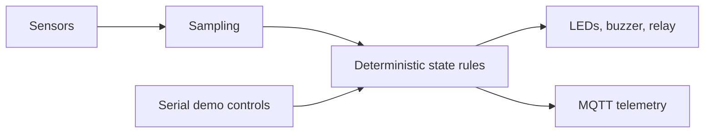

# ESP32 Multi-Zone Fire Warning Prototype

A three-zone IoT prototype for a library fire-warning demonstration. One shared ESP32 firmware project is configured for zones A, B, and C.

The source separates sensor sampling, deterministic alarm logic, actuators, and MQTT connectivity. This repository is an educational prototype; hardware and cloud validation must be established separately.

## Implementation

| Component | Responsibility |
| --- | --- |
| Sensors | MQ-2 smoke input, DHT11 temperature/humidity, IR flame input |
| Logic | Configurable normal, warning, and alarm states |
| Actuators | Zone LEDs, buzzer, and relay linkage demonstration |
| Connectivity | Aliyun IoT MQTT telemetry and downlink scaffold |
| Demo controls | Serial status, self-test, and sensor overrides |



## Repository layout

```text
firmware/zone_node/   Shared PlatformIO project and modular C++ source
docs/                Architecture, GPIO mapping, MQTT topics, test plan
cloud/               Setup notes and example payloads
AGENTS.md            Engineering constraints
```

## Build and configuration

Install PlatformIO when working on this project. From the repository root:

```sh
cd firmware/zone_node
cp src/config_local.example.h src/config_local.h
# Fill the local configuration for your devices.
pio run -e esp32-zone-a
```

Use `esp32-zone-b` or `esp32-zone-c` for the other nodes. Local Wi-Fi and device credentials belong only in the ignored `config_local.h`; the tracked example documents required values.

Hardware wiring is described in [pin mapping](docs/pinmap.md). See [architecture](docs/architecture.md), [test plan](docs/test-plan.md), and [original build notes](docs/original-build-notes.md).

## Status and validation

The existing source implements the shared firmware, state logic, serial demonstration controls, and MQTT scaffold. Cloud rules, notification workflows, and deployment credentials remain external.

The repository cleanup preserves firmware bytes and configuration profiles. It does not establish new hardware, cloud, or field-test results. See [validation record](docs/validation.md).
